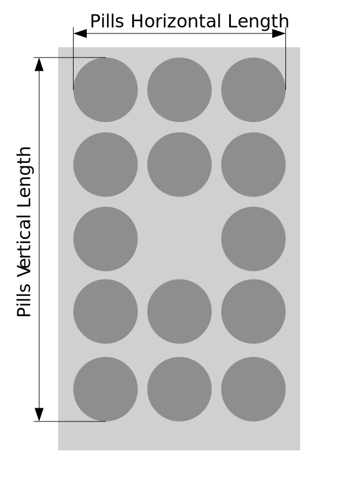

<!--
SPDX-FileCopyrightText: 2024 Diego Elio Pettenò
SPDX-License-Identifier: 0BSD
-->
# blister-buster

An OpenSCAD script to bust open a (parameterized) blister of pills.

## What Is This?

This repository contains an [OpenSCAD](https://openscad.org/) script.

The script generates a three-parts contraption: a base onto which to
lay a blister of pills, a grid to align it, and a "buster plate" that,
once pressed onto the other two, pops open the whole blister of pills
at once.

The script contains parameters for the number of pills present in the
blister, and whether there is a "center" pill (descriptions are partly
documented in the script itself) so that it can be used with many
different types of blisters.

In addition to the printed components, you'll need two alignment pins.
I use 4x30mm steel pins, but there's parameters to change this in the
script itself.

## Designing, Printing, and Using.

### Parameters

You'll need to configure a few parameters in the `blister-buster.scad`
file to fit your particular blister. You'll need to know:

* the flat dimension of the blister ("length" and "width");
* the diameter of a pill on the blister (not the pill itself, but
  rather the pill's "pod");
* the number of pills lengthwise (rows) and widthwise (columns);
* only if both rows and columns are odd, whether there is a pill in
  the center of the blister;
* the total extension of the pills vertically and horizontally
  as shown in the diagram above.

### Printing

I have printed all of my busters in PLA, 15% gyroid infill, 0.24mm layer.

### How To Use

1. Fit hte alignment pins on the base.
2. Put the blister you want to pop on top of the base's grid, pills up.
3. Fit the alignment plate on top, using the alignment pin holes as guide
   (this should ensure that the pills in the blister are aligned with the
   holes in the base's grid).
4. Put the buster plate on top, with the domes matching the pills, use the
   alignment pins to guide you.
5. Press the buster plate onto the blister to pop all the pills in short
   order.

## Why Is This?

[I have diabetes](https://flameeyes.blog/tag/diabetes/), and for that
I take Metformin. In the countries I lived in, Metformin is provided in
blisters, rather than bottles. While I'm sure there are motivations
behind it, these blisters are annoying to deal with.

Besides issues with their disposal (they are not usually recycled),  I
have more than once cut myself on particularly strong blister film,
which, having diabetes, takes a bit more time than average to heal.

So instead I generally break open a couple of boxes, bust the blisters,
and keep the pills in dark glass bottles on the table for easier
consumption (as well as in store-bought pill boxes when traveling.)

My first few designs were done in Fusion 360, but as the brand of pills
changes depending on who holds the contract with my pharmacy time by
time, it got annoying to tweak it for a new size of blisters. Thus, the
fully parameterized script.
